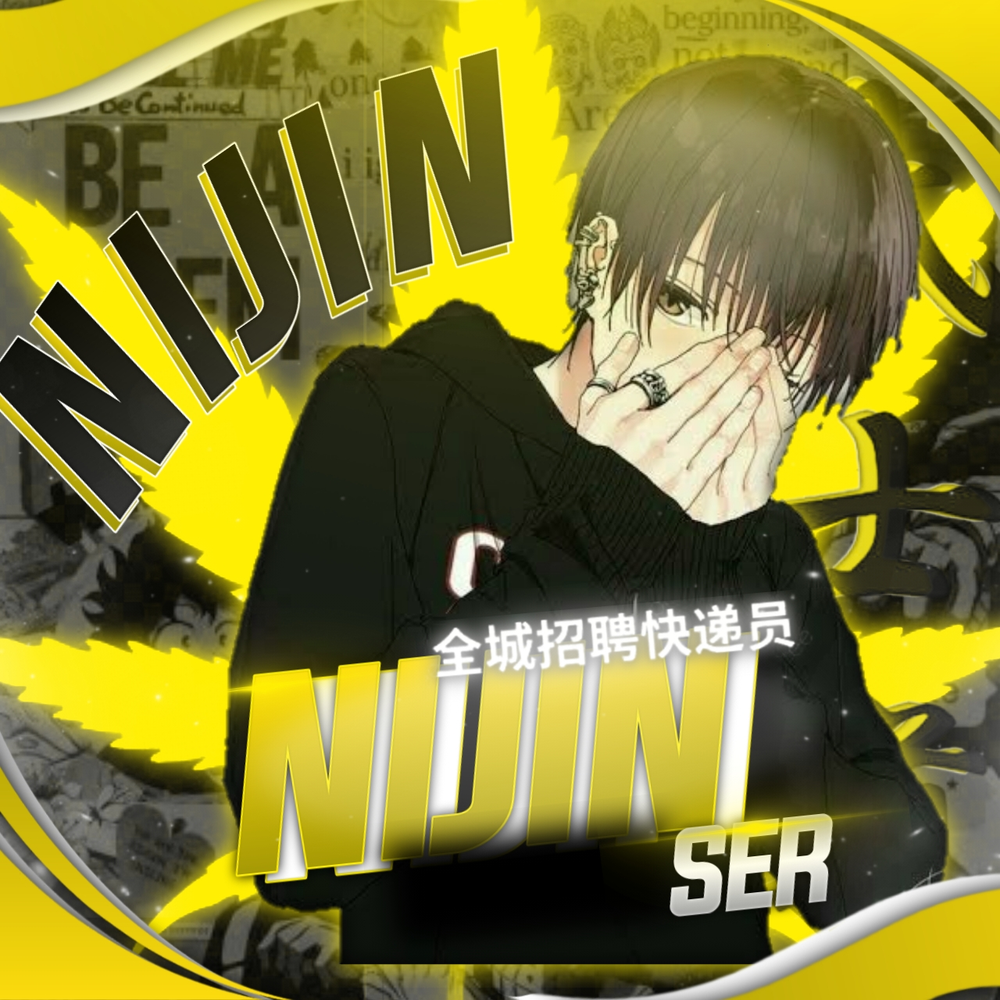

## [](https://git.io/typing-svg)
<p align="center">

<p align="center">
  ī.ᴀᴍ/ꪶ͢ɴɪᴊɪɴ sᴇʀꫂ⁩


</div>

<p align="center">
<a href="##"></a>
</p>
<p align="center">
 <a href="https://github.com/NIJIN-MUNNA"></a>  <a href="https://Wa.me/+919605385305?text=Hello%20NIJIN%20Bro🌝...fen%20boi%20aan😌💝"></a>
<p align="center">
<a href="https://chat.whatsapp.com/G68814z2vFJA62Ac4yTBr6"></a> <a href="https://instagram.com/_nijin_333"></a>
</p>

</p>

<div align="center">

 ### BIG THANKS TO💝

<div align="center">


---


# Installation
## For Windows
```bash
git clone https://github.com/NIJIN-MUNNA/AZNU
cd AZNU
npm install
node main.js
```
## For Termux
```bash
apt update && apt upgrade
pkg update && pkg upgrade
pkg install git
git clone https://github.com/NIJIN-MUNNA/AZNU
ls
cd AZNU
npm i -g npm@6.14.14
npm install
npm audit
npm audit fix
npm start
```

# THANKS TO
* [`NIJIN`](https://github.com/NIJIN-MUNNA)
* [`PEPE`](https://github.com/roshanpepe)


